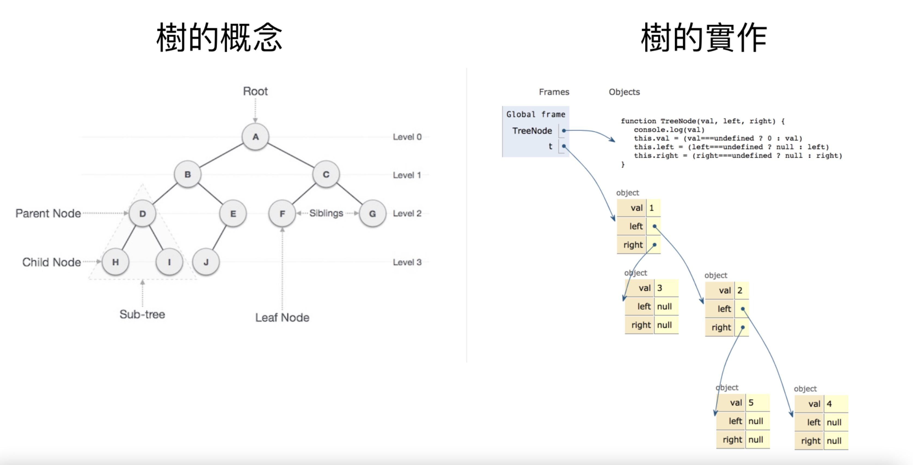

# Data Structure and Algorithm Note

### 01. 何謂資料結構

資料：一堆元素所組成的有限集合  
結構：元素間的組成關係
有時候會用 Collection 或 Container 來描述資料結構

### 01-1. Data Type

```
1. a set of data
2. the operations operations that can be performed on the data
=> 資料提供的運算方法
```

### 01-2. ADT (Abstract Data Type)

```
抽象資料型態
1. 資料如何儲存
2. 資料如何運算
=> 定義跟實作分開，知道怎麼用但不知道底層如何實作。
```

### 01-3. JavaScript 資料結構

| immutable | mutable          |
| --------- | ---------------- |
| 原始型別  | 非原始型別       |
| Number    | Array            |
| String    | Object           |
| Boolean   | Function         |
| Null      | Date             |
| Undefined | Regex            |
| Symbol    | Construct 建構式 |

<hr >

### 01-4. 演算法

Def: 在有限時間內，完成特定功能之有限個指令之集合，按部就班解決一個問題的方法。

- 目的是提升時間複雜度
- 一般的『流程控制』是透過條件與迴圈定義城市的運作而演算法則是更有效率地控制流程

| 經典演算法          | 常用解題技巧    |
| ------------------- | --------------- |
| Search & Sort       | Two Pointer     |
| Recursion           | Sliding window  |
| Backtracking        | Merge Intervals |
| Greedy              | Cyclic Sort     |
| Divide and Conquer  | Subsets         |
| Dynamic Programming | Top-K Elements  |

### Linked-List in JS

node 跟 node 所組成的結構

### Linked-List 種類

1. Simple Linked List：單向的 Linked List 會包含兩個值目前節點的值，和指向下個節點的連結
2. Doubly Linked List：雙向的 Linked List 會包含三個值：目前節點的數值、向後的節點連結、向前的節點連結
3. Circular Linked List：

- Singly linked list: 最後一個 node 往後，會到第一個 node 。
- Doubly Linked List: 最後一個 node 往後，會到第一個 node ；第一個 node 往前，則會到最後一個 node

```js
// ES5 function 實現
function ListNode(var) {
    this.var = val;
    this.next = null;
}

function LinkedList(){
    this.head = new ListNode('head');
    this.node = new ListNode('node');
    ...
    this.find = find;
    this.insert = insert;
    this.remove = remove;
}

// ES6 class
class Node {
    constructor(item) {
        this.item = item;
        this.next = null;
    }
}

class LinkedList {
    constructor(){
        this.head = new Node('head');
    }
    append(node) {
        ...
    }
}

```

---

## Linked List & Array 區別

|               | Linked List                                                                                                       | Array                                                                                                  |
| ------------- | ----------------------------------------------------------------------------------------------------------------- | ------------------------------------------------------------------------------------------------------ |
| 記憶體        | 不需要連續的記憶體空間                                                                                            | 連續的記憶體空間                                                                                       |
| 節點型態      | 各 node 形態不同                                                                                                  | 各 node 形態相同                                                                                       |
| 空間配置      | 不需預留空間                                                                                                      | 需事先宣告連續空間                                                                                     |
| 資料插入/刪除 | 在已知位置的情況下，插入/刪除一個 item 需 O(1)(實務上完成插入刪除，需要經過「搜尋 O(n)」和「插入刪除 O(1)」)      | 插入/刪除皆為 O(n)                                                                                     |
| 資料查詢      | 從頭找起 O(n)，速度慢                                                                                             | 隨機存取 index O(1)，速度快                                                                            |
| 額外指標空間  | 需要額外 pointer 空間                                                                                             | 不需要                                                                                                 |
| 適用時機      | a. 無法預期資料數量時，使用 linked list 會沒有 resize 問題 <br>b. 需要頻繁新增/刪除資料時 <br>c. 不需要快速查資料 | a. 希望快速存取資料<br> b. 已知欲處理的資料數量，便能確認矩陣的大小<br>c. 要求記憶體空間的使用越少越好 |

### 參考資料

<a href="http://alrightchiu.github.io/SecondRound/linked-list-introjian-jie.html">1. Linked List: Intro(簡介)</a>
<a href="https://www.geeksforgeeks.org/reverse-a-linked-list/">Reverse a LinkedList</a>

## Tree

Tree 就是非線性的 Linked-List，也就是每個節點都會有兩個往下的選擇，一個往左延伸、另一個往右延伸

### JS 實作 Tree

Tree 右邊要·比左邊大


#### Example 1

```js
function TreeNode(val) {
  this.val = val;
  this.left = this.right = null;
}

// 1-> 2 -> 3
const root = new TreeNode(1);
const root_right = new TreeNode(2);
const root_right_left = new TreeNode(3);

root.right = root_right;
root.left = root_right_left;
```

#### Example 2

```js
// 2 -> 7 -> 9

const root = new Tree(2);
const secondRoot = new Tree(7);
const thirdRoot = new Tree(9);

root.right = secondRoot;
root.left = thirdRoot;
```

三種常見的 Tree
原則:依照 root 輸出順序不同來決定(非 root 都是左->右)

1. In-order traversal
   輸出順序由小到大(左中右)

2. Pre-order traversal
   先輸出 root (中左右)

3. Post-order traversal
   最後輸出 root(左右中)

4. Level-order traversal [廣度優先] <br>
   上到下一層一層的找

Tree 實作

AVT: 平衡樹
RBT: 紅黑樹

### Binary Search Tree 的時間複雜度

why 是 O(log n) 不是 O(n/2)?
因為每切一次就是(n/2)，而無限次下去就會是(n/2)^n => 就會是(n/2)^m => log n

這樣理解！

```
每次搜尋都會把資料量砍半(除以2)，砍了x次後會剩下一筆資料，也就是我們搜尋目標。數學上可以這樣寫：
n = 資料總筆數
x = 要做幾次 (時間複雜度)
n / 2^x = 1
n = 2^x
x = log n
```

## Map & Set

### A. Map 要點

- 類似 Object，但 Map 的 key 可以是任意資料型態。
- Map 有依序

#### Map 內建

1. 創建 Map: 兩兩一組，array 包 array，有點像 php

```js
let map = new Map([
  ["one", 2],
  ["two", 2],
]);
//Map(2) {"one" => 2, "two" => 2}
```

2. map 中增加一組 map.set(key, val);

```js
map.set("three", 3);
// Map(3) {"one" => 2, "two" => 2, "three" => 3}
```

3. 取得 map map.get(key);

```js
map.get("three"); // 3
```

4. 刪除 map.delete(key);

```js
map.delete("three"); // true
// Map(3) {"one" => 2, "two" => 2}
```

輸出

```js
5. map.keys()  // MapIterator {"one", "two"}

6. map.values()  // MapIterator { 2 , 2 }

7. map.entries() // MapIterator {'one' => 2, 'two' => 2}
```

### B. Set 要點

- 找交集&聯集，無 index 無 key
- 重複的會被視為唯一值
- 無取出來做操作的用法(Set 為最小運算單位)
- 多數著重在 has，集合資料比對
- 加入新元素時，Set 內部會用===來判斷是否有重複值，NaN 會被判斷為重複值(雖然 NaN !== NaN)
- JS 的 set 有順序

```js
const setA = new Set();
setA.add(NaN); // Set(1) {NaN}
setA.add(NaN); // Set(1) {NaN}
// 即使NaN !== NaN 但這邊會被視為重複的
```

- JS 的 set 有順序，因為是用 array 實做出來的

Set 用法

```js

1. set.add(1);
2. set.delete(1);
3. set.has(1);

```

### C. HashMap

由 key & value 所作成的資料結構。有 key 跟 value 就能當作 HashMap
=> Array, Object, Map
有 key value 就可以是 hash map

Hash function
Object: key
Array: index

### String & Array 的差別

都基於 index
String => immutable 可比較

Array => mutable 可排序，不能比較

---

## Recursive 遞迴

如果一個 function 重新呼叫自己，就稱為遞迴

<a href="https://www.youtube.com/watch?v=t4MSwiqfLaY&t=24s">Recursion CS50</a>

```js
function foo(parameters) {
  if (Base Case)
    return 結果
  else
    General Case ( foo() )
}
```

### Recursion & Iteration 比較

| 項目            | Recursion  | Iteration                |
| --------------- | ---------- | ------------------------ |
| 程式碼          | 精簡       | 冗長                     |
| 區域暫存變數    | 少         | 少                       |
| 程式執行時間    | 長(無效率) | 短 (甭額外處理 push/pop) |
| 額外 Stack 支持 | 需要       | 不需要                   |

### 常見 Recursion 題型

KEY: 寫 Recursion 一定要 return function

- "Design an algorithm to compute the nth..."
- "Write code to list the first nth..."
- "Write code to define base case"
- "Implement a method to compute all..."

---

- Factorial 階乘
- GCD 最大公因數
- Fibonacci 費氏數列
- 河內塔
- Permutations 排列組合

### 資料結構 總結

愈簡單的概念，解法愈多，變化愈多
愈複雜的概念，解法愈少，變化愈少

Tree 的彈性比較少，基本上就 Iteration & Recursion

### 建 Index 方法

- B+ Tree
- Hashing
- Bitmap
- Reverse Index
